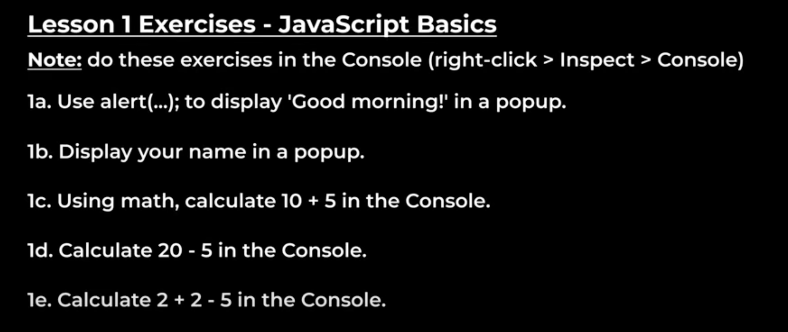
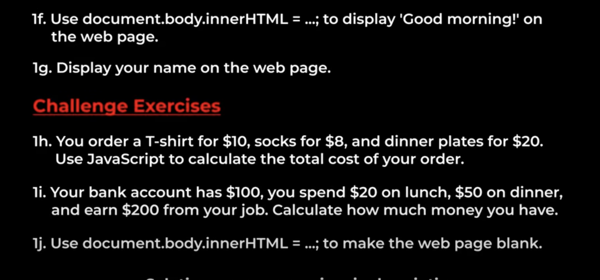

# Part 1 Lesson 1 - JavaScript Basics
This lesson goes over the Javascript basics, showing that JavaScript is used as instructions to tell the computer what to do.

- JavaScript is case-sensitive
- Syntax is the coding rules we have to follow when using programming languages

- Go to SuperSimpleDev's JS Practice [Website](https://supersimple.dev/js-basics/)

- Enter into the console ```alert('hello');``` to see an alert box with the 'hello' text inside appear on the Browser window.

- Enter into the console ```2 + 2```, and the console will show it can do the Math entered into it, producing ```4``` on the next line of the console
  - More specifically it also assigns the result a variable ```= $2``` ($1 is the variable for the <html> code running the website).
  - This means that if we input ```3 + 3``` into the console, resulting in ```6``` and assigning that value to ```= $3```, so that if we put into ```$2 + $3``` it will assign the value ```10``` to ```= $4```

- Enter into the console ```document.body.innerHTML = 'hello';```, and we see the whole webpage change to display the text 'hello'.
  - This accesses into the HTML of the <body> of the webpage and re-write it all to 'hello'

## Exercises for Lesson 1 - JavaScript Basics


